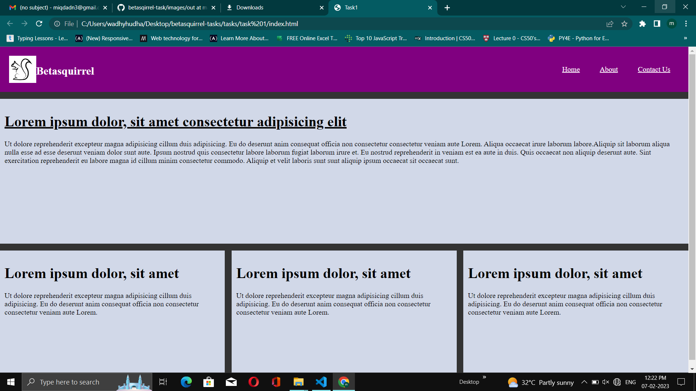
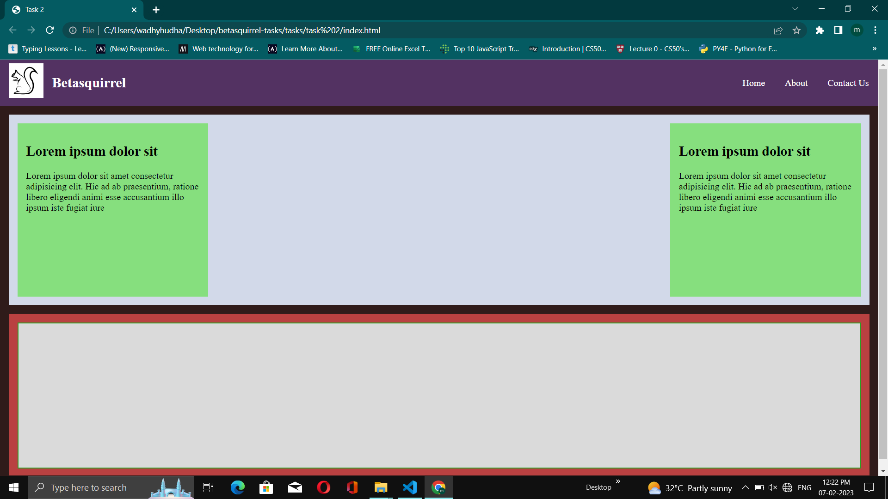
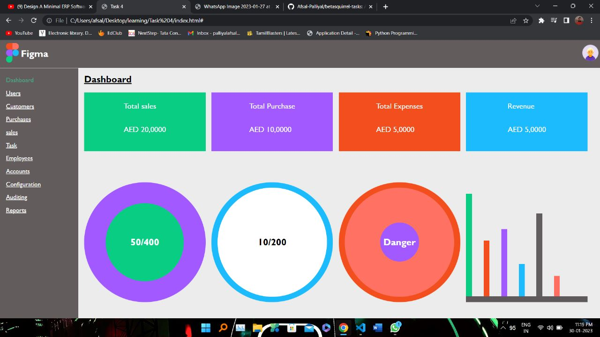
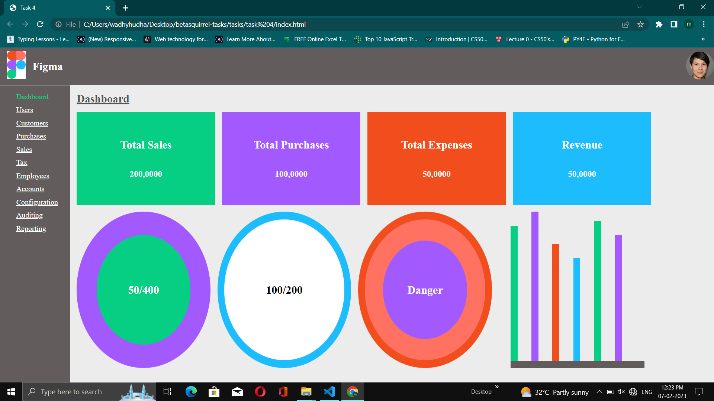

# Myprofiles

[linkedin](https://www.linkedin.com/in/muhammed-miqdad-n-28966419a)

[Stackoverflow](https://stackoverflow.com/users/21201659/miqdadn)

# betasquirrel-tasks

Assignments

[Static Site](https://muhammedmiqdad.github.io/betasquirrel-tasks/)

## Linux-commands

- `cd` - Change current directory. Eg: `cd Desktop`
- `cd ..` - One step back.
- `ls` - List contents of a directory.
- `ls -a` - Lists of hidden files.
- `pwd` - Display current working directory path.
- `cat` - Display contents of a file.
- `clear` - Clear screen.
- `mkdir`- Create folder.

## Git-commands

1. `git config` - Config git user Eg:`git config --global user.name "enter use name"`
2. `git config email` -Config git email Eg:`git config --global user.email "enter email"`
3. `git clone` - Clone a remote git repo to your local Eg:`git clone https://github.com/Muhammedmiqdad/betasquirrel-tasks`
4. `git add` - Add your file changes to git (`git add .`)
5. `git status` - Check status
6. `git commit` - Commit changes to git
7. `git push` - Push local commits to repo
8. `git config --list` - to see the config added
9. `git reset --hard` - remove all changes
10. `git diff` - see the changes on each file
11. `git log` - see commit history
12. `git init` - initialize git repo on a directory
13. `git stash` - see the uncommited changes

## Requirements

| Requirements                            | Output                                  |
| --------------------------------------- | --------------------------------------- |
|  |  |
|  |  |
|  |  |

## Task 3

Reading tasks

- [HTML Home](https://www.w3schools.com/html/default.asp)
- [Introduction](https://www.w3schools.com/html/html_intro.asp)
- [Editors](https://www.w3schools.com/html/html_editors.asp)
- [Basics](https://www.w3schools.com/html/html_basic.asp)
- [Elements](https://www.w3schools.com/html/html_elements.asp)
- [Attributes](https://www.w3schools.com/html/html_attributes.asp)
- [Headings](https://www.w3schools.com/html/html_headings.asp)
- [Paragraphs](https://www.w3schools.com/html/html_paragraphs.asp)
- [Styles](https://www.w3schools.com/html/html_styles.asp)
- [Formatting](https://www.w3schools.com/html/html_formatting.asp)
- [Quotation](https://www.w3schools.com/html/html_quotation_elements.asp)
- [Comments](https://www.w3schools.com/html/html_comments.asp)
- [Colors](https://www.w3schools.com/html/html_colors.asp)
- [Css](https://www.w3schools.com/html/html_css.asp)
- [Links](https://www.w3schools.com/html/html_links.asp)
- [Images](https://www.w3schools.com/html/html_images.asp)
- [Favicon](https://www.w3schools.com/html/html_favicon.asp)
